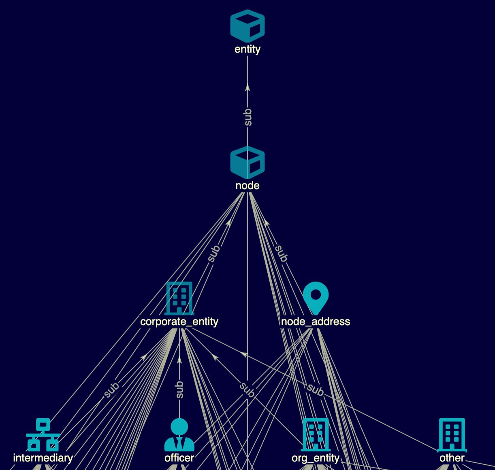
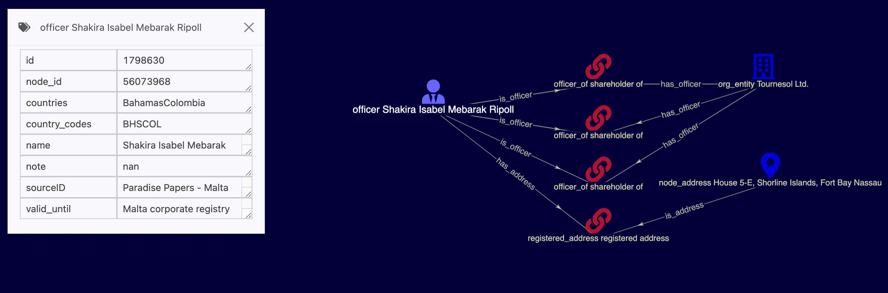

# TypeDB Offshoreleaks Database

### Intro
### Schema entity types



### Example query
[Shakira](https://www.icij.org/investigations/paradise-papers/6069/)

"match $x isa officer, has name contains 'Shakira Isabel Mebarak Ripoll';"

### Dataset stats:
* 803,089 org_entities
* 747,001 officers
* 26,775 intermediaries
* 2,920 others
* 391,069 addresses
* 3,273,525 relations
## Quick start

Prerequisites: Python >3.6, [TypeDB Core](https://vaticle.com/download#core) 2.6.0, [TypeDB Python Client](https://docs.vaticle.com/docs/client-api/python) 2.6.0

### Clone this repository to your computer

```shell
git clone https://github.com/typedb-osi/typedb-data-offshoreleaks.git
```

### Set up a virtual environment and install the dependencies:

```shell
cd typedb-data-offshoreleaks
python3 -m venv .venv
source .venv/bin/activate
pip install -r requirements.txt
```

### Download and preprocess the datasets

```shell
bash ./preprocess.sh
```

### Start TypeDB and migrate the data into the database

start typedb in a separate terminal
```shell
# let java use up to 16GB of memory
JAVAOPTS="-Xmx16G" typedb server
```
migrate the data into typedb 
```shell
# run the migrator with 4 separate processes
python3 ./migrator.py -n 4
```
For options:

```shell
python3 ./migrator.py -h
```

### Start querying the database

To query the database, either use [TypeDB console](https://docs.vaticle.com/docs/console/console) or download a graphical user interface. 
A free option is [TypeDB Studio](https://github.com/vaticle/typedb-studio),
Nodelab, the GUI used for the examples above, will be available shortly (contact [Jon Thompson](https://www.linkedin.com/in/jonatanthompson/) for information)

## Licence

The data was first made available by the International Consortium of Investigative Journalists (ICIJ) under the [Open Database License](http://opendatacommons.org/licenses/odbl/1.0/) and the [Creative Commons Attribution-ShareAlike](http://creativecommons.org/licenses/by-sa/3.0/) license. It is re-published here under the same licences. 
The data should be used under the same terms set out on the ICIJ website: https://offshoreleaks.icij.org/pages/database.

## Credits
[Jon Thompson](https://www.linkedin.com/in/jonatanthompson/)